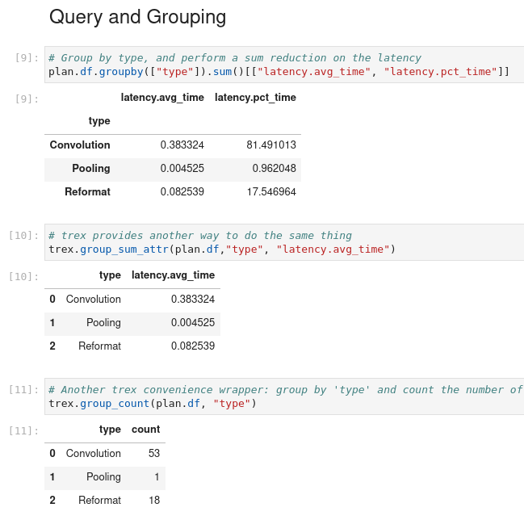

# trex-docker

## Introduction

This is a Dockerfile to use [TREx](https://developer.nvidia.com/blog/exploring-tensorrt-engines-with-trex/) on Docker container.

## Requirements

- Docker

## Preparation

## Build Docker image

```shell
docker build --build-arg UID=$(id -u) --build-arg GID=$(id -g) -t trex:0.1.6 .
```

## Create Docker container

```shell
docker run -it --rm --net=host -v $HOME:$HOME trex:0.1.6 bash
```

## Sample

```shell
cd TensorRT/tools/experimental/trt-engine-explorer/notebooks
jupyter lab --ip=0.0.0.0 --no-browser
```

Please open `api-examples.ipynb` in Jupyter Lab.



## Reference

- <https://developer.nvidia.com/blog/exploring-tensorrt-engines-with-trex/>
- <https://github.com/NVIDIA/TensorRT/tree/main/tools/experimental/trt-engine-explorer>
